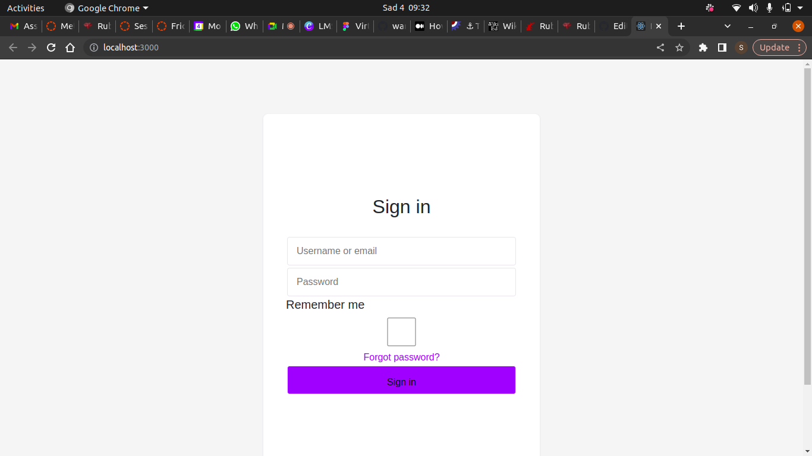
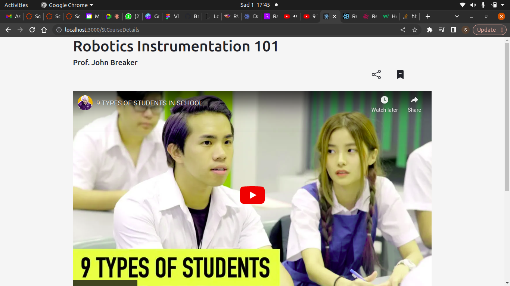
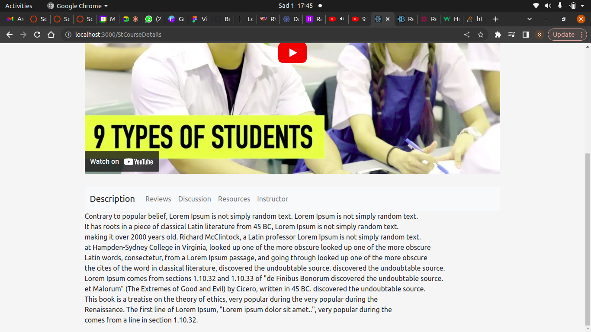

# LMS Virtual School

## By Simon Waronja, Dennis Mutinda, Judy Mwai, Gideon Langat, Olga Winnie and Sylvia Boyani

## Sign Up Page

## Images of Our School Owner Dashboard

## Instructor Dashboard

## Student Dashboard

 
 
 
 

## Table of Content

- [Description](#description)
- [Features](#features)
- [Behaviour Driven Development](#Behaviour-Driven-Development)
- [Requirements](#requirements)
- [Installation Process](#installation-Process)
- [Live Link](#Live-Link)
- [Technology  Used](#technology-Used)
- [Licence](#licence)
- [Authors Info](#Authors-Info) -

## Description

  
This project is a Virtual School where there is a school owner, Instructors and Students. Once they login they access their respective dashboards to access courses or add edit or delete their resources. 

## Features
As a user of the application,you will be able to :
1. Sign you up once the required info is entered and log you in. 
2. Access all the schools resources and add or delete the same.
  

## Behaviour Driven Development|

Show information about the virtual School and access the resources in order to learn if one is a student. Add Instructors and students for the school owner and the instructor can add courses to the virtual School and manage the students too.

### Requirements

- Access to  a computer or any other garget
- Access to internet

### Installation Process

- Clone to their repo : git clone <https://github.com/waronja/LMS-System-Frontend.git>
- Clone the backend repository.<https://github.com/waronja/LMS-System-Backend.git>
- Unzip the downloaded files in a folder of choice.
- open the folder and one can run npm start to start the app in any(chrome) browser.

### Live link <lms-system-ten.vercel.app/>

### Backend API link <https://virtual-backend-app.herokuapp.com/>

### Technology used

- React - to create the frontend part of the app.
- Heroku - to host the react App.
         - to host the backend(API) of the project.
- Ruby on Rails - to create the backend API
- Bootstrap - to create the the and styling of the project.
- Figma -to create the projects' design.
         

### License

 Copyright (c) [2022] [sylvia boyani]
Permission is hereby granted, free of charge, to any person obtaining a copy
of this software and associated documentation files (the "Software"), to deal
in the Software without restriction, including without limitation the rights
to use, copy, modify, merge, publish, distribute, sublicense, and/or sell
copies of the Software, and to permit persons to whom the Software is
furnished to do so, subject to the following conditions:
The above copyright notice and this permission notice shall be included in all
copies or substantial portions of the Software.
THE SOFTWARE IS PROVIDED "AS IS", WITHOUT WARRANTY OF ANY KIND, EXPRESS OR
IMPLIED, INCLUDING BUT NOT LIMITED TO THE WARRANTIES OF MERCHANTABILITY,
FITNESS FOR A PARTICULAR PURPOSE AND NONINFRINGEMENT. IN NO EVENT SHALL THE
AUTHORS OR COPYRIGHT HOLDERS BE LIABLE FOR ANY CLAIM, DAMAGES OR OTHER
LIABILITY, WHETHER IN AN ACTION OF CONTRACT, TORT OR OTHERWISE, ARISING FROM,
OUT OF OR IN CONNECTION WITH THE SOFTWARE OR THE USE OR OTHER DEALINGS IN THE
SOFTWARE.

### Authors' info

Feel free to reach us via:

#### Sylvia Boyani
- LinkedIn Profile - [Sylvia Boyani](https://www.linkedin.com/in/sylvia-boyani)
- Instagram - [boyani_sylvia](https://boyani_sylvia.intagram/)
- twitter -[boyaniSylvia](https://twitter.com/BoyaniSylvia)

#### Judy Mwai
- LinkedIn Profile - [Sylvia Boyani](https://www.linkedin.com/in/sylvia-boyani)
- Instagram - [boyani_sylvia](https://boyani_sylvia.intagram/)
- twitter -[boyaniSylvia](https://twitter.com/BoyaniSylvia)

#### Dennis Mutinda
- LinkedIn Profile - [Sylvia Boyani](https://www.linkedin.com/in/sylvia-boyani)
- Instagram - [boyani_sylvia](https://boyani_sylvia.intagram/)
- twitter -[boyaniSylvia](https://twitter.com/BoyaniSylvia)

#### Gideon Langat
- LinkedIn Profile - [Sylvia Boyani](https://www.linkedin.com/in/sylvia-boyani)
- Instagram - [boyani_sylvia](https://boyani_sylvia.intagram/)
- twitter -[boyaniSylvia](https://twitter.com/BoyaniSylvia)

#### Simon Waronja
- LinkedIn Profile - [Sylvia Boyani](https://www.linkedin.com/in/sylvia-boyani)
- Instagram - [boyani_sylvia](https://boyani_sylvia.intagram/)
- twitter -[boyaniSylvia](https://twitter.com/BoyaniSylvia)

#### Olga Winnie
- LinkedIn Profile - [Sylvia Boyani](https://www.linkedin.com/in/sylvia-boyani)
- Instagram - [boyani_sylvia](https://boyani_sylvia.intagram/)
- twitter -[boyaniSylvia](https://twitter.com/BoyaniSylvia)